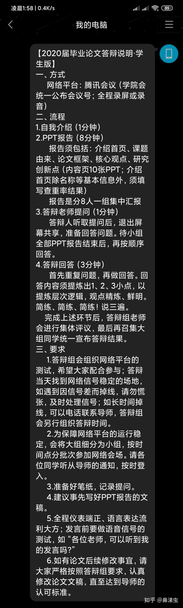
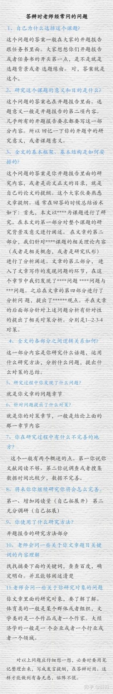

#### 答辩

```java
倪老师：
另外，关于答辩，每个人预计讲5分钟左右，回答问题5分钟，可以准备PPT，也可以直接演示，主要是告诉评委老师，你自己所做的工作，简明扼要即可，做硬件的同学，需要拍一段硬件演示的视频，放到光盘里，并拍一张照片，放档案袋
```


##### 论文摘要

主题：基于LD3320的语音识别垃圾分类器系统，通过语音识别对垃圾进行分类。

##### 背景

2019年1月31日，上海市十五届人大第二次会议表决通过了《上海市生活垃圾管理条例》，该条例于2019年7月1日起正式施行。这意味着生活垃圾分类工作正式纳入法治框架。

2019年，北京市第十五届人民代表大会常委会第十六次会议表决通过北京市人大常委会关于修改《北京市生活垃圾管理条例》的决定，新《条例》于今年5月1日正式实施，为有效管理生活垃圾，切实提高生活垃圾减量化、资源化和无害化提供了法律依据，标志着垃圾分类迈入新阶段。


**突出重点（亮点），**我的**研究对象，研究方法及工具**


##### 研究背景

##### 核心内容

##### 成果展示

##### 论文总结

```java
1.研究背景
主要介绍前人已经做了哪些工作、你打算做些什么、有什么意义。
2.研究过程
主要介绍你的毕业设计的开展过程、做了哪些工作。
3.研究结果
列出来你得到了哪些结果、结论，分析有什么意义。
4.展望和致谢
简单的说一下还有哪些值得进一步改进的地方。
最后一页感谢在座的评审老师。
```


```java
第一张：封面
第二张：选题背景（研究意义）
第三张：创新点
第四张：论文框架和论文中精彩部分（重点讲）
第五张：致谢
```


我当时老师问我参数的选择是怎么回事，为啥是这个范围，有啥意义。简单说一下你对自己论文的理解。


注意：但如果，我们能够开头有一个**提纲挈领**的ppt，起码可以告诉老师我们干了啥，对吧？


1.为什么选这个课题？研究它有什么现实意义、学术价值。

2.论文基本框架、基本结构安排？


```java
尊敬的各位评委老师:      大家好! 我是来..，的学生**。 我的论文题目是...。 我当时之所以选择研究...是因为....主要表现在: ....      在着手准备论文写作的时候，我针对..这个命题，大量阅读相关 方面的各种资料。.对...的概况有了大致了解，缕清 思路的基础上确定研究方向，然后与老师商讨，确定论文大致思路和研究方向。然后，为了完成论文，本人收集了大量的文献资料，其中主要来自网上的论文期刊、图书馆的书目、学习教材的理论资料。在...导师的耐心指导和帮助下，经过阅读 主要参考资料，拟定提纲，写开题报告初稿，毕业论文初稿，修改等一系列程序， 于****年*月*日 正式定稿。具体来说，我的论文分为以下四个部分:第一部分，主要概述了.,,.第二部分,是在对..进行了详细论述的基础上，话运用.法:对...的深 入挖掘。第三部分，运用..，法对....的深入挖掘。第四部分，....     经过本次论文写作，我学到了许多有用的东西，也积累了不少经验，但由于学生能力不足，加之时间和精力有限，在许多内容表述上存在期望相差甚远，许多问题还有待于进-一步思考和探索，借此答辩机会，万分恳切的希望各位老师能够提出宝贵的意见，多指出本篇论文的错误和不足之处，学生将虚心接受，从而进一-步深入学习研究，使该论文得到完善和提高。在论文的准备和写作过程中，我阅读了大量的关于..的相关书籍和学术期刊，这得益于我们学校图书馆丰富的参考书籍和学术期刊数据库的专业论文。本文经过- -二三稿并最终定稿，在这期间，我的论文指导老.师...教授对我的论文进行了详细的修改和指正，并给予我许多宝贵的建议和意见。在这里，我对他表示我最真挚的感谢和敬意!以上就是我的答辩自述，希望各评委老师认真阅读论文并给予评价和指正。谢谢！
```

```java
尊敬的评委老师：       上午好!　　我来自**学院**班，我叫**，我的论文题目是******，本篇论文是在***教授的指导下完成的。在此，我十分感激她对我的精心指导，同时也感激各位评审教师出席本次答辩，以下是本篇论文的选题缘由、目的，资料收集准备工作以及文章结构。　　一、选题缘由、目的　　随着……（背景）近年来，……导致……（出现问题）。所以本文根据……，综合分析……，并提出可供借鉴的措施和路径。【这一部分开题报告都写过，可以直接搬来】　　二、资料收集准备工作　　自****年**月上旬选定题目后，为了完成论文，本人进行了很多的资料收集，有来自网上的论文期刊，图书馆的书目，最主要是来自于……在**教师的指导下，经过阅读资料，拟定提纲，调研，写开题报告初稿、定稿，毕业论文初稿、修改等一系列程序，于****年*月正式定稿。　　三、论文结构　　全文总共分为X个部分：　　第一部分是引言，该部分主要介绍了课题的研究背景和意义，还有国内外对本课题的研究状况。　　第二部分重点介绍了……　　第三部分介绍了……　　第四部分，主要介绍了……原因，包括……。　　第五部分……　　经过本次论文写作，本人学到了许多知识，也积累了不少经验，但由于本人本事不足，加之时间有限，在许多资料表述、论证上存在着不当之处，许多问题还有待进行一步思考和探究，借此答辩机会，希望各位老师能够提出宝贵的意见，多指出我的错误和不足之处，本人将虚心理解，从而不断进一步深入学习研究，使该论文得到完善和提高。以上是我对自我的论文简单介绍，请各位教师提问，谢谢。
```


```java
关于老师的提问，其实也不难。可以提前准备好问题的答案，自己多说几遍。一定要熟悉自己论文的 研究的问题/对象、研究目的于意义、理论基础、研究方法、案例/实验、结论和建议。记不住的点，可以写在纸上，放电脑旁边备用。常见的问题：1.选题的意义是什么？（你为什么选这个题目/研究这个对象？）【就是问研究意义、研究目的；开题里都写了】2.研究背景是什么？（有哪些与你题目相关的研究？）【文献综述的内容挑一部分讲就行。简单讲一下相关的理论、国内外研究现状】3.研究方法是什么/你是如何完成这篇论文的？【研究方法有 文献研究、案例研究、问卷调查、访谈、跟踪研究、实验等；根据实际情况说】4.论文的创新点在哪?【可以讲选题上的创新、研究方法的创新、结论的创新】5.论文的理论依据是什么？【讲理论是什么，简单介绍一下这个理论】 6.你认为论文有哪些不足之处？【可以说 参阅文献不够多，案例不够丰富，分析不够彻底；或者问卷数量不够多，实验次数较少等等；也可以说 由于疫情影响无法实地收集数据 等等；顺带说一下改进意见】7.论文定稿后有没有发现新的问题？有什么弥补措施或调整建议？【这个肯定要说“有”，其实和上面的不足之处差不多】 8.关于论文本身的其他细节问题：论文研究成果在……的实际应用中要注意什么？能举例说明如何使用……方法/措施吗？……理论具体是指什么/内容是什么？运用的公式是什么？（理工科类的问题，我就不讲了；反正就是会针对论文你的案例、数据、实验等作出提问）回答问题时注意几点：1.回答不能太短。千万不能一句话完事，建议讲1-2分钟。2.遇到没有准备到的问题，可以先说“感谢老师的提问”或者请老师再重复一遍问题，这样增加一点思考时间，然后回忆论文里与之相关的内容讲一下；也可以提前把论文打印出来，方便翻阅。3.确实不会的问题，可以找理由，但不能直接说“对不起，这个问题我不会答”。例如：老师，您说的这个问题我在写论文时也有想到，只是这个问题我搜集了许多资料，比如（xxx文献）也未能想出一个比较好的答案，才疏学浅无法回答，希望能得到老师的指点，我再之后在去进行修改和查阅。老师，您说的这个问题我在写论文时也有想到，但是和我的论文主体内容不是很相符合，后来我就没有考虑过，并且和我的导师商量后发现意义不是很大（强调和导师商量）4.如果老师指出你论文的毛病，承认并感谢指导就行。不要杠。
```


```java
序号 引用片段详情 1 如何把这些生活垃圾变废为宝，从而实现生活垃圾的资源化利用，垃圾分类回收无疑是最好出路[1] 2 从简易垃圾桶，到脚踏垃圾桶，再到现如今的分类环保垃圾桶、智能垃圾桶，可以看出垃圾桶的不断发展
是社会文化的折射，也是人类文明的演变[2]
3 虽然传统的野外垃圾桶在造型上比较丰富，功能却比较单一，缺点也较明显，主要体现在[3]： 4
伴随着人们生活质量的提升与科学技术的前进，单一功用的垃圾桶现已满足不了人们的需求，尽管垃圾桶
的品种和数量在不断翻新和添加，但人们愈加重视它的美观性和实用性，并向着“小巧”“智能化”方向
发展[4]，垃圾分类智能管理系统的规划与实现是一项专业性很强的实用技术，以装载废物为基础功用
，在保证适用性的前提下利用物联网与科学技术生成愈加便捷、可靠、环保、智能的产品
5 感应垃圾桶主要体现在红外线测距技能[5]，或是拥有超声波感应器 6
商业广告垃圾桶（图12），虽然在某种程度上具有一定的商业价值，但没有真正意义上完成垃圾桶对于垃
圾分类处理的功能，对于目前的科学技术水平而言，智能化垃圾桶逐步完成社会和经济效益[6]，包含供
给WIFI信号和USB接口手机充电
随着世界经济的逐渐变迁，人们的环保意识开始逐渐增强，同时人们对高品质生活的需求也在不断增加
，如今的垃圾桶，不仅外形美观，更是融环保与科技于一体[7]
8 就现在的科学技术水平而言，智能化垃圾桶已实现的经济和社会效益主要有[8]： 9 本课题的意图是规划一款多功能、高效率、经济实用、便捷可靠的智能分类垃圾桶，因此在规划过程中需
求遵循以下要求[9]：
10 为了能够在任何场景进行语音识别，满意开方式环境下的特定需求，不仅不受网络信号强弱约束，而且尽
可能小的占用CPU资源等这些条件，本文挑选非特定人语音识别系统[10]
11
蓝牙（Bluetooth）是一种短距离通信的无线电技术[11]，现在己在现代生活中许多范畴有广泛的使用
，其创造之初期望为设备间通讯树立一致规范的标准化协议，以处理用户在互不兼容的移动电子设备间互
联互通的问题，省去传统的外部电线
12 蓝牙采用从下至上的标准分层式结构[12]，体系构成有三个部分，其中无线射频单元担任数据和语音的发
送和接收
13 除此之外还有最重要的蓝牙协议[13]规范，蓝牙协议规范主要由三部分组成（图 23）：
14 系统选用HC-05[14]（图 24）作为体系蓝牙模块
15 它致力于需要快速中止响应的深层嵌入式应用，包含微控制器、汽车和工业控制系统[15]
16 它采用尾链中断技术[16]，选用完全硬件基础上中断处理，最大12个时钟周期数能够削减（ARM724-42个
周期需要），实际的使用70%中断能够削减
17 LD3320语音识别芯片运用的技术是基于“关键词语列表”的自动语音识别(Auto Speech Recognition,
ASR) [17]技术
18 这种规划办法是从底层开端，实际使用中规划本钱和开发周期都比自顶向下法[18]优
19 该函数库还包含每一个外设的驱动描绘和运用实例，为开发者访问底层硬件提供了一个中心API，经过运
用固件函数库，开发者无需深化把握底层硬件细节，就可以运用每一个外设[19]
```


#### 注意事项



