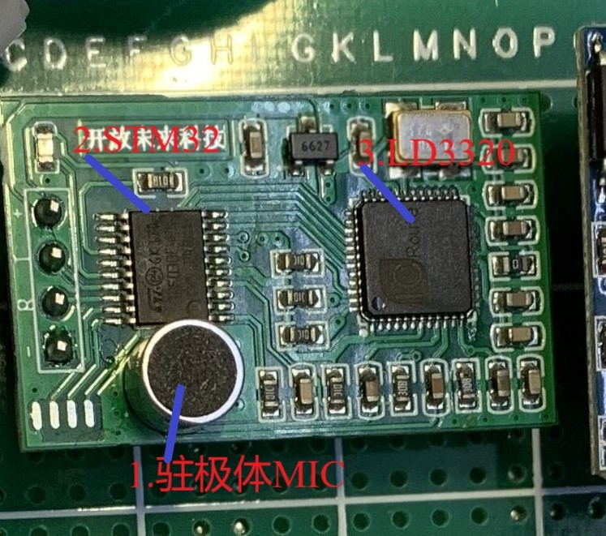

#### 问题/知识点

1.系统供电电压 stm32 3.5v  直流还是交流

答： 直流 模块上有稳压电路稳压到3.3v  交流转直流（类似手机充电）

单片机板子上有LDO（低压差线性稳压器）稳压芯片

上位机和蓝牙通信

​	（1）上位机如何接收数据	答：单片机UART接口通信

​	（2）上位机程序如何开发的	答:上位机网络通信

3.if(YuYin_RX_CMD=='a' || YuYin_RX_CMD=='b')//唤醒

4.语音指令如何写入

5.调试SWD下载接口，SWD不仅可以下载，也可以调试程序

6.B6B7B8B9可以用作PWM输出，用作驱动舵机

7.单片机内置ADC功能（AD转换），A0-A7 B0B1是ADC输入口


```java
我做了笔记：GND，3.3v都是内部相通的。3.3v直接给单片机供电，5v接口会通过LDO稳压芯片给单片机供电。microusb只能供电不能下载。另一端swd下载接口，和跳线帽搭配使用 ，Jlink，STlink都可以。跳线后可串口下载（PA9 PA10）,建议swd,方便测试。PC13连指示灯。PB12~PB15是SPI2，PA4~7是SPI1, PA9 PA10是串口1，PA2 PA3是串口2,PB10 PB11串口3，PB6~PB9一般可以用于pwm输出，对应TIM4。 PC13~15 用于时钟相关。VB用于后备电源供电。ADC接口：PA0~PA7,PB0 PB1。尽量别用PB3 PB4 PA15，它们和下载口相关。
```


##### 语音识别模块



1.MIC：驻极体话筒MIC将拾取的声音信号转换成电信号后

2.STM32单片机

3.LD3320芯片

4.R & T: UART接口的通信接口和单片机、电脑通信

5.-+:正负极，3.3 - 5v工作电压

##### LD3320录入语音指令

1USB转TTL模块通过UART接口和LD3320连接通信

#### 知识点

Altium Designer 用于原理图设计

Visual Studio 开发工具开发上位机程序

