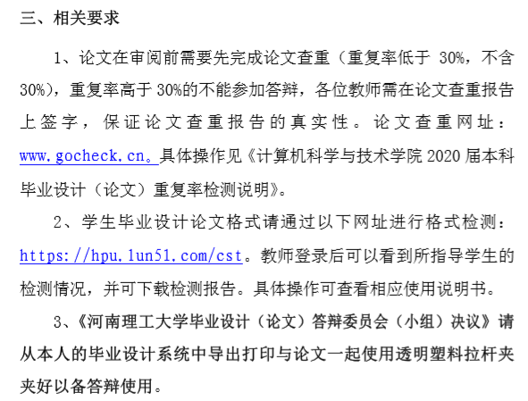
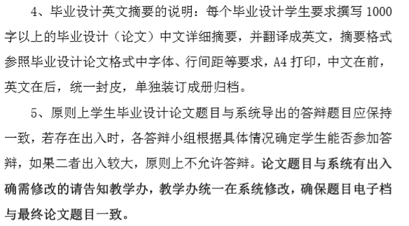
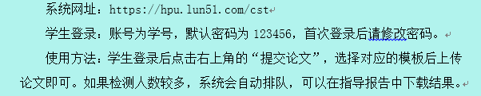
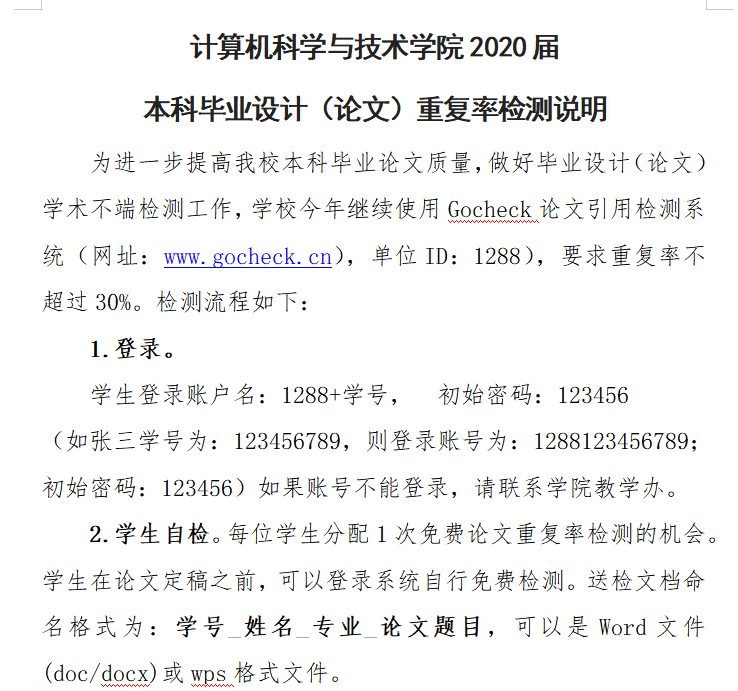

```java
2020/5/28 16:13:15
倪老师 2020/5/28 16:13:15
关于线上答辩的几点要求：1：做硬件的同学建议提前录一个小视频进行展示，同时存放在光盘中。2、硬件事物存档时请拍一张清楚的实物图，打印出来放在毕业设计档案袋中；3、线上答辩的学生建议让学生提前联系答辩秘书将论文电子稿提前提交答辩组。

22:16:51
倪老师 2020/5/29 22:16:51
@全体成员 请所有同学注意了，咱物联网专业16级6.3上午8点开始答辩，下面是关于答辩的安排，请每位同学认真阅读！！！

倪老师
已回校的同学按系统分组到指定教室或实验室参与答辩，未回校的同学分组名单如上，请按名单要求，加入各组的QQ群，由各组组长安排和通知答辩事宜

22:22:08
倪老师 2020/5/29 22:22:08
6月2日 要打印出所有论文材料，先不装订，用文件夹夹好，答辩时交给答辩组老师，线上答辩的同学，请在校的同学代为打印，并交给答辩组老师

22:24:59
倪老师 2020/5/29 22:24:59
答辩顺序：各组先安排线下答辩，然后是线上答辩，所以线上答辩的同学的答辩时间，由各组老师负责安排和通知

22:28:40
倪老师 2020/5/29 22:28:40

倪老师 2020/5/29 22:29:24
需要归档的材料，这个文件里说的很细致，请大家认真阅读

另外，关于答辩，每个人预计讲5分钟左右，回答问题5分钟，可以准备PPT，也可以直接演示，主要是告诉评委老师，你自己所做的工作，简明扼要即可，做硬件的同学，需要拍一段硬件演示的视频，放到光盘里，并拍一张照片，放档案袋

10:00:13
倪老师 2020/5/30 10:00:13
@全体成员 注意，要打印的材料不是只有论文，昨晚给的文件有详细说明，最多总共有10项，都需要准备好！
```




```java
 2020/5/27 17:13:47
倪老 2020/5/27 17:13:47

@全体成员 论文评阅后需要按照意见认真修改，修改后的论文30号以后可以重新上传
倪老 2020/5/27 17:14:04

30号以前是不能上传的 
```


大家统一按照15周来写


```java
关于线上答辩的几点要求：1：做硬件的同学建议提前录一个小视频进行展示，同时存放在光盘中。2、硬件事物存档时请拍一张清楚的实物图，打印出来放在毕业设计档案袋中；3、线上答辩的学生建议让学生提前联系答辩秘书将论文电子稿提前提交答辩组。
```


@全体成员 学院刚发了最新通知，论文提交到系统的时间是5.23，后面几天需要评阅老师评阅和指导老师审阅，5.31前要把所有的工作都准备好，6.3-4要进行答辩，请大家务必按这个时间节点完成任务

为进一步提高我校本科毕业论文质量，做好毕业设计（论文）学术不端检测工作，学校今年继续使用Gocheck论文引用检测系统（网址：www.gocheck.cn)，单位ID：1288），要求重复率不超过30%。检测流程如下：

2.学生自检。每位学生分配1次免费论文重复率检测的机会。学生在论文定稿之前，可以登录系统自行免费检测。送检文档命名格式为：学号_姓名_专业_论文题目，可以是Word文件(doc/docx)或wps格式文件。
论文检测结果仅作为教师指导和学生毕业设计（论文）修改完善的参考依据。指导教师根据毕业设计管理系统中的评阅意见和检测结果，督促学生进一步完善论文。

这个是论文格式检测的网址



